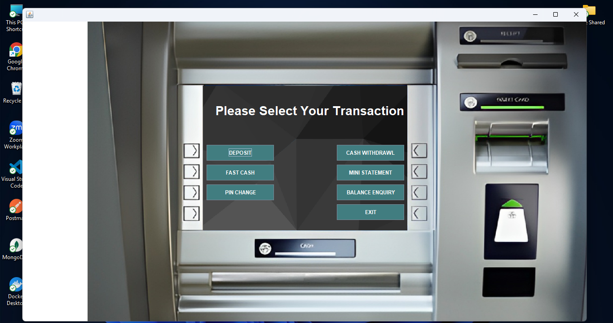

# Bank Management System ( Virtual ATM)

A Java-based desktop application simulating core functionalities of a bank, such as ATM transactions, account management, and balance enquiry, built using Swing for the GUI.

## Features

- **User Authentication**: Login using Card Number and PIN.
- **Deposit**: Deposit money into your account.
- **Withdraw**: Withdraw cash with a custom amount.
- **Fast Cash**: Quick withdrawal of predefined amounts (e.g., Rs. 100, Rs. 500, etc.).
- **Mini Statement**: View a mini statement with recent transactions and masked card number.
- **Balance Enquiry**: Check current account balance.
- **PIN Change**: Update your account PIN.
- **Exit**: Securely exit the application.
- **Account Creation**: Create new bank accounts with options for account type and services (ATM card, Internet Banking, Mobile Banking, Email Alerts, Cheque Book, E-Statement).

## Technologies Used

- **Java** (Swing): For building the GUI.
- **JDBC**: For database operations (assumes backend database connectivity).
- **OOP Principles**: Modular classes for each major operation (`Deposit`, `Withdrawl`, `FastCash`, `BalanceEnquriy`, `mini`, etc.).

## Screenshots

Below are some screenshots from the `img` folder demonstrating the application's interface:

<div align="center">
  
  <p><em>Main ATM Interface</em></p>
</div>

## Directory Structure

```
src/bank/management/system/
    |- main_Class.java           // Main dashboard with transaction options
    |- Login.java                // Login screen for users
    |- Deposit.java              // Deposit money functionality
    |- Withdrawl.java            // Cash withdrawal functionality
    |- FastCash.java             // Fast cash withdrawal
    |- mini.java                 // Mini statement generation
    |- BalanceEnquriy.java       // Balance enquiry window
    |- Signup3.java              // Account creation (step 3: account/services selection)
    |- ... (other supporting classes)
img/
    |- login_screen.png
    |- atm_interface.png
    |- deposit_screen.png
    |- withdraw_screen.png
    |- ... (other images)
LICENSE                         // MIT License
```

## Getting Started

### Prerequisites

- **Java JDK** (8 or above)
- **Database** (such as MySQL) configured with the required schema for user and transaction data
- **IDE** (Eclipse, IntelliJ IDEA, NetBeans, etc.)

### Running the Application

1. **Clone the repository:**
   ```bash
   git clone https://github.com/skmirajulislam/Bank-Management-System.git
   cd Bank-Management-System
   ```

2. **Set up the database:**
   - Create a database and configure the JDBC connection in the `Connn` class.
   - Ensure tables for users, accounts, and transactions exist.

3. **Compile and run:**
   - Open the project in your IDE.
   - Run `main_Class.java` or `Login.java` to start the application.

## License

This project is licensed under the [MIT License](LICENSE).

## Author

- [Mirajul Islam](https://github.com/skmirajulislam)

---
**Note:** This is a learning project for educational purposes and does not implement real banking security protocols. Do not use with real financial data.
